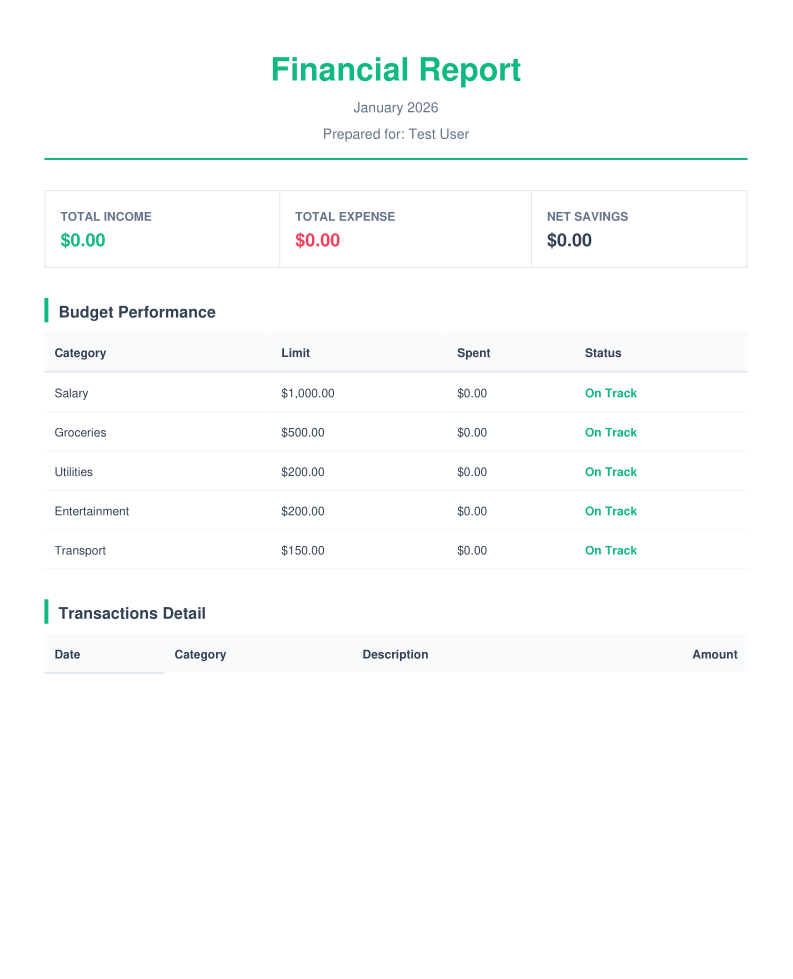

# Ledgerly: Personal Finance Tracker

**Ledgerly** is a high-performance, modern financial management application built with **Laravel 12**, **Inertia.js v2**, and **React**. It features a "FinTech" aesthetic with a focus on speed, security, and intuitive user experience.



## 🚀 Key Features

- **Dynamic Dashboard**: Real-time balance calculations, monthly income vs. expense tracking, and savings rate analysis.
- **Interactive Analytics**: Visual distribution of expenses and 6-month financial trends using custom-engineered responsive charts.
- **Global Currency Support**: Seamlessly switch between **USD ($)** and **PHP (₱)** with persistent user preferences.
- **Budget Tracking**: Set category-specific budgets and monitor burn rates with visual progress indicators.
- **Transaction Ledger**: Advanced filtering, search, and pagination for full control over your financial history.
- **Modern UI/UX**:
    - **Soft UI Aesthetic**: A clean, premium emerald-and-slate theme.
    - **Loading Skeletons**: Professional placeholder states for improved perceived performance.
    - **Dark Mode Support**: Optimized for both light and dark viewing environments.

## 🛠️ Technical Stack

- **Backend**: Laravel 12.x (PHP 8.2)
- **Frontend**: React + Tailwind CSS
- **Bridge**: Inertia.js v2 (SPA architecture)
- **Authentication**: Laravel Sanctum (SPA Mode)
- **Database**: MySQL 8.0
- **State Management**: Server-driven state with Inertia hooks

## 📦 Installation

1. **Clone the repository**:
   ```bash
   git clone https://github.com/yourusername/personal-finance-tracker.git
   cd personal-finance-tracker
   ```

2. **Install dependencies**:
   ```bash
   composer install
   npm install
   ```

3. **Environment Setup**:
   ```bash
   cp .env.example .env
   php artisan key:generate
   ```
   *Configure your database settings in the `.env` file.*

4. **Run Migrations & Seeders**:
   ```bash
   php artisan migrate --seed
   ```

5. **Start the development server**:
   ```bash
   php artisan serve
   npm run dev
   ```

## 📂 Project Structure

- `app/Http/Controllers`: Backend logic handling dashboard data, transactions, and user profiles.
- `app/Models`: Relational database models (User, Category, Transaction, Budget).
- `resources/js/Pages`: React components for Dashboard, Ledger, and Settings.
- `resources/js/Components/Skeletons`: Reusable loading state components.
- `database/migrations`: Normalized database schema with foreign key constraints and indexes.

## 🛡️ Security & Performance

- **Authorization**: Granular access control using Laravel Policies (Users can only access their own data).
- **Validation**: Strict input sanitization via Laravel Form Requests.
- **Performance**: Eager loading of relationships to prevent N+1 query issues and optimized Vite/Rolldown builds.

---
Built with ❤️ by [Jay Guiroy](https://github.com/jay-guiroy)
